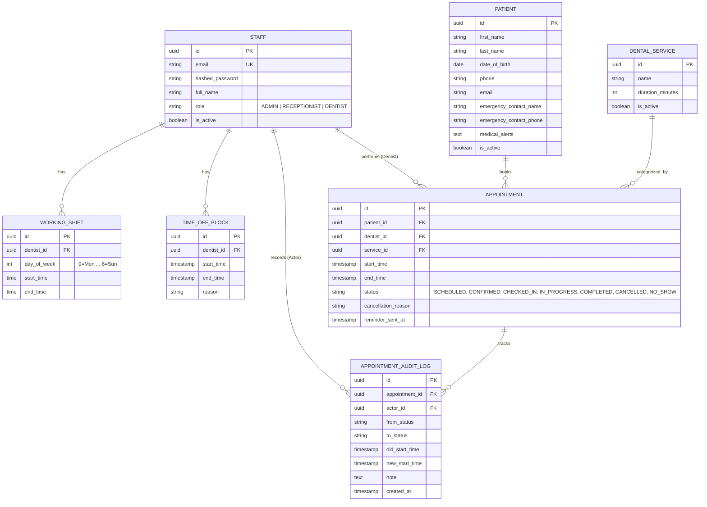
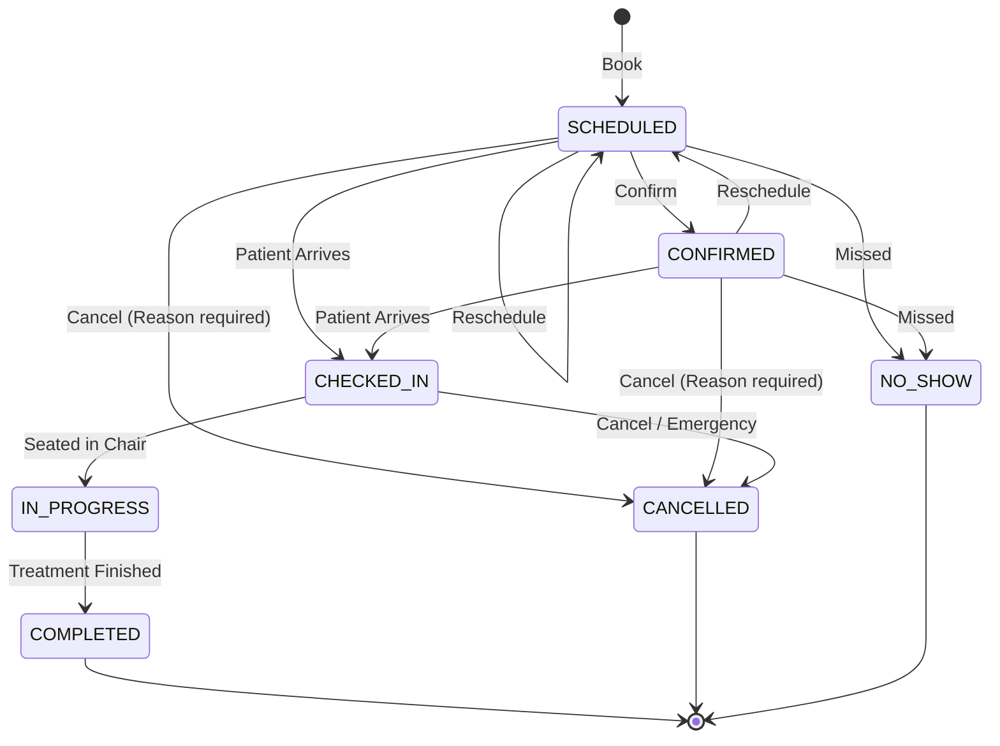

# Dental Clinic Appointment Tracker — PRD

_Status: Approved · Date: 2026-10-03 · Owner: Product & Engineering_

## 1. Problem and Goals

### 1.1 Problem Statement
Dental practices handle dozens of appointments daily across multiple dentists and hygienists, each requiring different chair durations and procedural equipment. Traditional paper schedules or generic calendar tools result in double-bookings, missed cancellations, no-shows, lack of waiting room visibility, and compliance disputes regarding who modified an appointment. 

### 1.2 Goals
- Provide a robust, internal-only backend API for clinic staff (receptionists, dentists, office managers) to manage the entire lifecycle of patient visits.
- Guarantee zero double-booking through atomic, database-enforced scheduling guards.
- Offer automated availability calculations for procedure-specific durations without requiring manual slot creation.
- Keep front desk and operatory screens synchronized in real time via live appointment event streaming.
- Reduce patient no-show rates via automated booking confirmations and 24-hour pre-visit reminders.

### 1.3 Measurable Success Criteria (3 Months Post-Launch)
- Zero double-booked appointments across all active providers.
- Sub-100ms p95 latency for availability slot lookups and booking requests.
- 100% audit coverage for all appointment reschedules, cancellations, and status changes.
- Significant reduction in no-show rate through timely 24h reminders.

---

## 2. Actors and Roles

The system is staff-facing only for v1; patients do not possess direct login accounts.

| Actor | Description | Can | Cannot |
|---|---|---|---|
| **Admin / Office Manager** | Clinic operations manager | Manage staff accounts and roles, configure dental services and standard durations, override shifts, view all data and audit logs | Delete historical appointment records |
| **Receptionist** | Front desk coordinator | Create/search/edit patient records, book appointments, reschedule appointments, cancel appointments (with reason), check in arriving patients | Create or delete staff accounts, modify clinical treatment notes |
| **Dentist / Provider** | Clinical practitioner | View daily/weekly schedule, mark appointments `IN_PROGRESS` or `COMPLETED`, record treatment notes, set own time-off blocks | Modify system-wide service catalogs or manage other staff accounts |

---

## 3. Glossary

The canonical glossary is maintained in [CONTEXT.md](file:///c:/Users/seyi/Documents/Development/Raven/CONTEXT.md). Core terms include:
- **Clinic**: The single physical dental practice operating in canonical timezone `CLINIC_TIMEZONE`.
- **Staff**: Authenticated user with role `ADMIN`, `RECEPTIONIST`, or `DENTIST`.
- **Patient**: Care recipient identified by demographics and medical alerts; has no login account.
- **Dental Service**: Procedure offered (e.g. Checkup, Extraction) with standard duration in minutes.
- **Working Shift**: Recurring weekly time window during which a Dentist is available.
- **Time-Off Block**: Ad-hoc period (vacation, lunch, sick leave) when a Dentist is unavailable.
- **Available Slot**: Dynamically computed open time window within a shift matching a service duration.
- **Appointment State**: Lifecycle state (`SCHEDULED`, `CONFIRMED`, `CHECKED_IN`, `IN_PROGRESS`, `COMPLETED`, `CANCELLED`, `NO_SHOW`).
- **Cancellation Reason**: Mandatory explanation supplied when an appointment is cancelled.
- **Appointment Audit Log**: Append-only record tracking all slot changes and status transitions.
- **Notification**: Asynchronously dispatched message (booking confirmation or 24h reminder).

---

## 4. Functional Requirements

### 4.1 Authentication & Staff Management

#### R-1 Staff Authentication & Token Issuance
- **Behaviour:** Staff members log in via username/email and password to obtain a scoped JWT access token.
- **Rules:** Passwords must be hashed using Argon2 or bcrypt. Tokens encode user ID, role, and expiration. Unauthenticated requests to protected endpoints return `401 Unauthorized`.
- **Acceptance:**
  - *Given* an active staff user with valid credentials, *When* they submit `POST /api/v1/auth/token`, *Then* the system returns `200 OK` with a Bearer JWT access token and user role.
  - *Given* invalid credentials, *When* login is attempted, *Then* the system returns `401 Unauthorized`.
- **Priority:** Must

#### R-2 Role-Based Access Control (RBAC)
- **Behaviour:** Endpoints enforce access rules using role dependency guards.
- **Rules:** Admin has unrestricted access; Receptionist can manage patients and bookings; Dentist can access their own schedule and update clinical status.
- **Acceptance:**
  - *Given* a user authenticated with role `RECEPTIONIST`, *When* attempting to create a new staff account, *Then* the system returns `403 Forbidden`.
  - *Given* a user authenticated with role `ADMIN`, *When* creating a new staff account, *Then* the system returns `201 Created`.
- **Priority:** Must

---

### 4.2 Patient Management

#### R-3 Patient Profile Management
- **Behaviour:** Receptionists and Admins can create and update patient profiles with demographics and medical alerts.
- **Rules:** First name, last name, date of birth, and primary phone number are mandatory. Optional fields include email and emergency contact. High-level medical alerts (allergies, medical conditions, notes) must be recorded and highlighted.
- **Acceptance:**
  - *Given* valid demographic fields and allergy flags, *When* staff post to `POST /api/v1/patients`, *Then* a new patient profile is created with `201 Created`.
  - *Given* missing mandatory fields (e.g. phone number or DOB), *When* staff attempt creation, *Then* the system returns `422 Unprocessable Entity`.
- **Priority:** Must

#### R-4 Patient Search & Retrieval
- **Behaviour:** Staff can search patients by name (partial match) or phone number, and retrieve full profile details including appointment history.
- **Rules:** Search queries must support case-insensitive prefix/substring search and return paginated results.
- **Acceptance:**
  - *Given* multiple registered patients, *When* staff query `GET /api/v1/patients?search=smith`, *Then* matching active patients are returned with pagination metadata.
- **Priority:** Must

#### R-5 Patient Soft Deletion
- **Behaviour:** Patients can be archived/soft-deleted if they leave the practice or request inactivity.
- **Rules:** Soft-deleted patients are hidden from active booking searches. Existing past appointments retain referential integrity. Hard deletion is forbidden.
- **Acceptance:**
  - *Given* an existing patient, *When* staff invoke `DELETE /api/v1/patients/{id}`, *Then* the patient is marked `is_active = false` and cannot be selected for new bookings.
- **Priority:** Must

---

### 4.3 Dental Services Catalog

#### R-6 Dental Service Management
- **Behaviour:** Admins can define, update, and deactivate dental services offered by the clinic.
- **Rules:** Each service has a name, description, duration in minutes (positive integer, e.g. 15, 30, 45, 60, 90), and an active toggle. Deactivating a service preserves historical bookings.
- **Acceptance:**
  - *Given* an Admin user, *When* submitting `POST /api/v1/services` with name "Routine Cleaning" and duration `45`, *Then* the service is saved and available for booking.
- **Priority:** Must

---

### 4.4 Dentist Schedules & Availability Engine

#### R-7 Recurring Working Shift Configuration
- **Behaviour:** Staff configure weekly working shifts for each dentist (e.g. Dr. John: Mon & Wed 09:00–17:00).
- **Rules:** Shifts specify day of week, start time, and end time. Start time must be before end time. Shifts must not self-overlap for the same dentist on the same day.
- **Acceptance:**
  - *Given* an active dentist, *When* an Admin submits working shifts for Monday 09:00 to 17:00, *Then* the shift is recorded and used for subsequent slot computations.
- **Priority:** Must

#### R-8 Time-Off & Blocked Interval Management
- **Behaviour:** Dentists or Admins can record time-off periods (vacations, lunch breaks, emergency leaves).
- **Rules:** Blocked intervals have a start timestamp, end timestamp, and optional reason. Appointments cannot be booked within or overlapping a blocked interval.
- **Acceptance:**
  - *Given* a dentist with an active shift, *When* a time-off block is added from 12:00 to 13:00, *Then* slot computations exclude the 12:00–13:00 interval.
- **Priority:** Must

#### R-9 Dynamic Available Slot Calculation
- **Behaviour:** Staff can query available booking slots for a specified dentist (or all dentists), date, and dental service.
- **Rules:** Available slots are dynamically computed: Working shifts minus existing active appointments (excluding `CANCELLED`) minus time-off blocks, chunked into intervals equal to the service's duration.
- **Acceptance:**
  - *Given* a dentist working 09:00–12:00 with an existing appointment from 09:00–09:45, *When* querying available slots for a 45-minute service, *Then* 09:45–10:30 and 10:30–11:15 are returned as available start times.
- **Priority:** Must

---

### 4.5 Appointment Scheduling & Lifecycle FSM

#### R-10 Book Appointment
- **Behaviour:** Staff book an appointment for a patient with a designated dentist and service at a specific start time.
- **Rules:**
  - The end time is automatically calculated as `start_time + service.duration_minutes`.
  - The booking slot must fall entirely within the dentist's active working shift and not intersect any time-off block.
  - The booking slot must not intersect any other non-cancelled appointment for that dentist.
  - If a concurrent conflict occurs, the transaction rejects the write with `409 Conflict`.
  - Initial state is set to `SCHEDULED`.
- **Acceptance:**
  - *Given* an open slot, *When* staff submit `POST /api/v1/appointments`, *Then* the appointment is created with status `SCHEDULED`, end time auto-computed, and `201 Created` returned.
  - *Given* an overlapping appointment for the same dentist, *When* staff attempt to book the same slot, *Then* the system returns `409 Conflict` with an explanatory error message.
- **Priority:** Must

#### R-11 Reschedule Appointment
- **Behaviour:** Staff can move an existing appointment to a new date, time, and/or dentist.
- **Rules:**
  - Rescheduling is only allowed from states `SCHEDULED` or `CONFIRMED`.
  - The new target slot must be strictly available and conflict-free.
  - The status is reset to `SCHEDULED`.
  - An entry is recorded in the audit log capturing the old slot, new slot, acting staff ID, and timestamp.
- **Acceptance:**
  - *Given* an appointment in `SCHEDULED` status, *When* staff submit `POST /api/v1/appointments/{id}/reschedule` with a new valid start time, *Then* the appointment is updated and `200 OK` is returned.
  - *Given* an appointment in `COMPLETED` status, *When* rescheduling is attempted, *Then* the system rejects the request with `400 Bad Request` ("Cannot reschedule a completed appointment").
- **Priority:** Must

#### R-12 Appointment State Machine Transitions
- **Behaviour:** Appointments transition through a deterministic finite state machine (FSM).
- **Rules:**
  - Valid transitions:
    - `SCHEDULED` → `CONFIRMED`, `CHECKED_IN`, `CANCELLED`, `NO_SHOW`
    - `CONFIRMED` → `CHECKED_IN`, `CANCELLED`, `NO_SHOW`
    - `CHECKED_IN` → `IN_PROGRESS`, `CANCELLED`
    - `IN_PROGRESS` → `COMPLETED`
  - `COMPLETED`, `CANCELLED`, and `NO_SHOW` are terminal states; no further transitions are allowed.
- **Acceptance:**
  - *Given* a `CHECKED_IN` appointment, *When* the dentist sets status to `IN_PROGRESS`, *Then* the transition succeeds and updates status.
  - *Given* a `COMPLETED` appointment, *When* any user attempts to transition to `CANCELLED`, *Then* the system returns `400 Bad Request`.
- **Priority:** Must

#### R-13 Cancel Appointment
- **Behaviour:** Staff can cancel an upcoming appointment.
- **Rules:**
  - Cancellation requires a non-empty `cancellation_reason` (e.g. "Patient sick", "Emergency").
  - Status transitions to `CANCELLED`.
  - The freed slot immediately becomes available for other bookings.
  - Cancellation is recorded in the audit log with the acting staff ID and reason.
- **Acceptance:**
  - *Given* an appointment in `CONFIRMED` state, *When* staff submit `POST /api/v1/appointments/{id}/cancel` with reason "Patient rescheduled out of town", *Then* status becomes `CANCELLED` and `200 OK` is returned.
  - *Given* a cancellation request without a reason, *When* submitted, *Then* the system returns `422 Unprocessable Entity`.
- **Priority:** Must

#### R-14 Immutable Appointment Audit Log
- **Behaviour:** Every slot change, status transition, and cancellation generates an immutable audit record.
- **Rules:**
  - Captured fields: `appointment_id`, `actor_id` (staff), `from_status`, `to_status`, `old_start_time`, `new_start_time`, `timestamp`, `note`.
  - Audit records cannot be updated or deleted by any actor (including Admin).
- **Acceptance:**
  - *Given* an appointment undergoing check-in and completion, *When* staff query `GET /api/v1/appointments/{id}/audit-logs`, *Then* the chronological transition history is returned.
- **Priority:** Must

---

### 4.6 Real-Time Updates & Notifications

#### R-15 Live Server-Sent Events (SSE) Stream
- **Behaviour:** Front desk and operatory screens subscribe to a unidirectional SSE stream (`GET /api/v1/appointments/live`).
- **Rules:**
  - Emits events whenever an appointment is booked, rescheduled, cancelled, checked in, started, or completed.
  - Event payload contains `event_type`, `appointment_id`, `dentist_id`, `patient_name`, `status`, and `start_time`.
  - Connection sends periodic heartbeats (keep-alive comments) every 15 seconds.
- **Acceptance:**
  - *Given* an active SSE client connection, *When* an appointment is checked in via REST API, *Then* the client receives an `appointment.checked_in` event immediately.
- **Priority:** Should

#### R-16 Automated Booking & Reschedule Confirmation Dispatch
- **Behaviour:** Upon successful booking or rescheduling, the system dispatches an asynchronous confirmation message to the patient (via email or SMS).
- **Rules:** Handled via a pluggable `NotificationService` interface. For local dev and testing, a `LoggingNotificationService` prints the message payload without contacting external APIs.
- **Acceptance:**
  - *Given* a newly booked appointment, *When* the transaction commits, *Then* a confirmation dispatch task is executed and logged.
- **Priority:** Should

#### R-17 Scheduled 24-Hour Pre-Appointment Reminder
- **Behaviour:** An automated background process identifies appointments scheduled within the next 24 hours that have not yet received a reminder, and dispatches reminder notifications.
- **Rules:**
  - Checks for appointments where `start_time` is between 23 and 25 hours away and `reminder_sent_at` is null.
  - Upon sending, updates `reminder_sent_at` timestamp to prevent duplicate notifications.
- **Acceptance:**
  - *Given* an appointment 24 hours away with no reminder sent, *When* the reminder job runs, *Then* a reminder notification is dispatched and `reminder_sent_at` is populated.
- **Priority:** Should

---

## 5. Domain Model (Conceptual)

### 5.1 Entities and Relationships

### 5.2 Appointment Lifecycle State Machine

---

## 6. Non-Functional Requirements

- **NFR-1 (Zero Double-Booking):** The scheduling transaction must prevent overlapping appointments for the same dentist under concurrent access. Conflicting requests must return `409 Conflict`.
- **NFR-2 (Latency):** Availability slot queries and booking endpoints must respond with p95 < 100ms under standard operational load (up to 20 providers, 200 appointments/day).
- **NFR-3 (Timezone Consistency):** All database timestamps stored in UTC (`TIMESTAMPTZ`). Local business logic and slot generation must execute against the configured clinic wall-clock timezone (`CLINIC_TIMEZONE`), correctly accounting for Daylight Saving Time.
- **NFR-4 (Audit Immutability):** Appointment audit log entries are append-only. No endpoint or database user may update or delete audit records.
- **NFR-5 (Stateless Multi-Worker Operation):** The FastAPI application layer must be stateless to permit execution across multiple worker processes. In-memory locks are prohibited for concurrency control.
- **NFR-6 (Security):** All passwords stored with Argon2 or bcrypt. Access tokens use short-lived JWTs. Medical alerts and patient PII accessible only to authenticated clinic staff.

---

## 7. Integrations and Constraints

- **Framework:** FastAPI with Python 3.12+.
- **Database:** PostgreSQL with SQLAlchemy 2.0 (asyncio + asyncpg) and Alembic migrations. SQLite supported for fast in-memory unit tests.
- **Notification Provider:** Abstracted `NotificationService` interface with `LoggingNotificationService` used in local/testing environments. Pluggable adapters for Twilio (SMS) and SendGrid/SES (Email) for production deployment.
- **Deployment Target:** Docker containerized deployment, 12-factor configuration via environment variables (`CLINIC_TIMEZONE`, `DATABASE_URL`, `JWT_SECRET_KEY`).

---

## 8. Out of Scope (v1)

| Feature | Reason for Exclusion in v1 |
|---|---|
| **Patient Self-Service Portal** | Requires public auth, identity verification, anti-abuse throttling; v1 is internal staff-facing. |
| **Multi-Clinic / Multi-Tenant** | Adds tenant isolation and partitioning overhead not needed for a single practice. |
| **Dental Charting & X-Ray PACS** | Clinical charting and DICOM imaging are large specialized domains outside appointment scheduling. |
| **Billing & Insurance Claims** | Invoicing and payments will be integrated in a later billing phase. |
| **Two-Way External Calendar Sync** | Google/Outlook Calendar two-way sync introduces external sync conflict resolution; deferred to v2. |

---

## 9. Risks and Open Questions

| # | Question / Risk | Owner | Needed By |
|---|---|---|---|
| 1 | Should appointments support room / chair (operatory) resource allocation in addition to dentist assignment? | Operations | Tech Spec |
| 2 | What is the clinic cancellation policy window (e.g. minimum notice for cancellation without penalty)? | Clinic Manager | v2 (Billing) |

---

## 10. Decision Log

- [ADR 0001: Dynamic Slot Computation and Database Overlap Guard](file:///c:/Users/seyi/Documents/Development/Raven/docs/adr/0001-dynamic-slot-computation-and-conflict-prevention.md)
